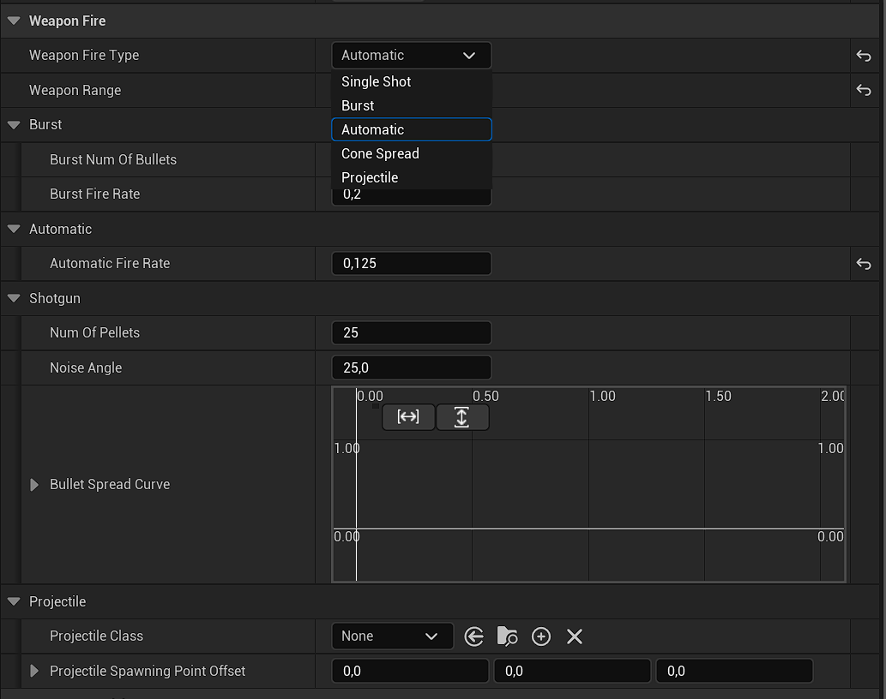
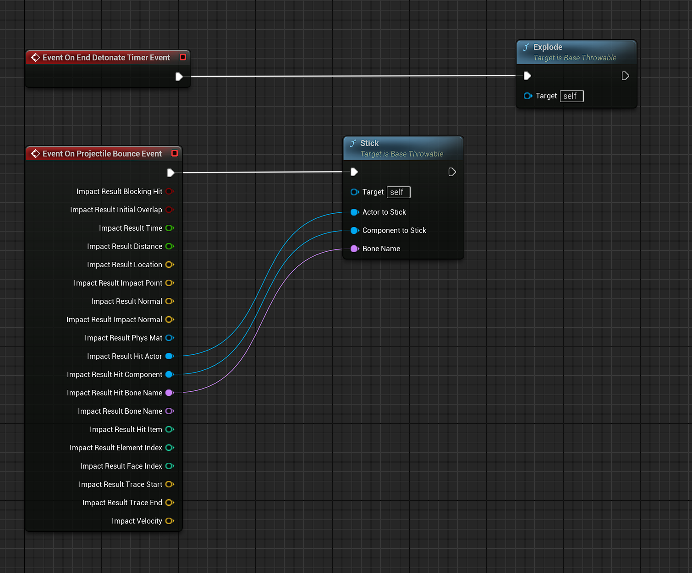
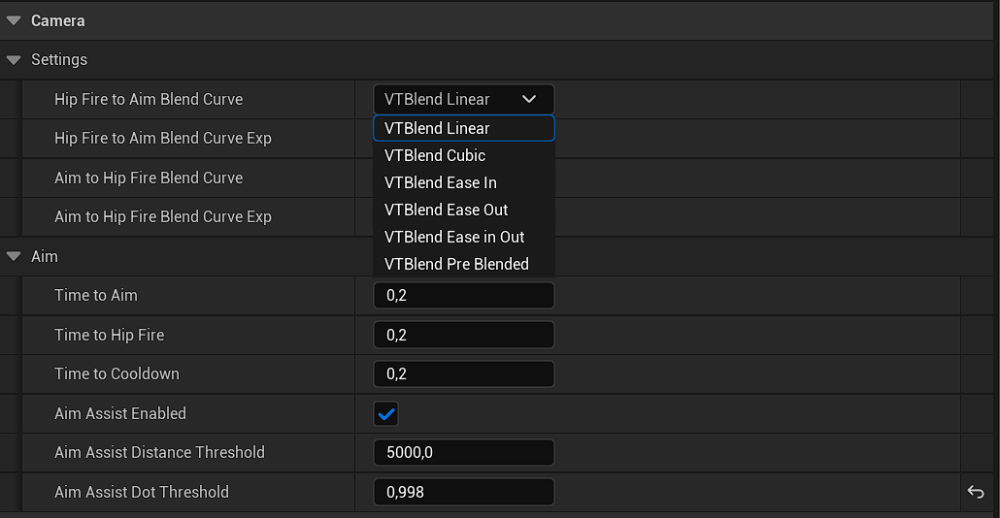

# KOTH Arena

## The project

### Concept Art

#### Main character

#### Zombies

### Overview
Koth Arena is a single and multiplayer shooter that takes inspiration from various
games like Unreal Tournament, Ratchet And Clank and Call of Duty. Players can compete in various modes, both single player and multiplayer.

### Game Modes

These are the main game modes:
* **Wave Mode**: inspired by Call Of Duty Zombies round system. There will be an infinite number of rounds and players must survive as long as possible. 
You must eliminate every enemy to complete a round. At the end of the game (when the player dies) the current round will be added to a scoreboard.
This mode can be played in split screen.
* **Time Mode**: to win a game, the player must complete a limited number of rounds. 
Every round must be completed within a time limit. Every subsequent round will have a shorter time limit. 
At the end of the game (the player dies or wins the game) the current score will be added to a scoreboard. A score is defined by num. of rounds completed and total time.
This mode can be played in split screen.
* **Multiplayer**: when a new game starts all players must compete in a different number of rounds in different locations (arenas). 
Every round will be a free for all match. In order to win a round, a player must reach a certain number of eliminations. 
The player who wins most rounds will be entitled as **King of the Hill** (winner of the game).

### Enemies
Enemies should be scaled up based on what round the player is. So every round would spawn a bigger number of enemies which would also be more responsive and “smart”.

* **Zombie**: classical zombie enemy. They follow the player wherever he is and they will try to hit him with melee attacks. 
They will also be capable of jumping and avoiding traps based on the difficulty of the current round.
* **Agent**: they will be capable of searching and shooting the player with a weapon. 
Different kinds of agents (mesh) using different kinds of weapons.
* **[Still Evaluating] Boss**: big enemy spawned every x rounds capable of attacking the player using weapons or melee attacks (or also some special ability).

## Features highlight

### Shooting

[Showcase video](https://youtu.be/O-YrZh5ycQ4)

Guns implemented: 
* Pistol (single-shot)
* Assault rifle (automatic fire)
* Burst rifle (burst fire)
* Launcher
* Shotgun (spread shot)

I've implemented shooting by creating a component, UWeaponFireComponent, which can be easily configured by designers. 
By configuring its properties you can create multiple kind of weapons without modifying any code.

### Throwable

[Showcase video](https://youtu.be/8iAP2KqI-EE)

Throwable objects implemented:
* Grenades, which explodes after few seconds
* Knives, which deals damage on hit someone
* Sticky bombs, which explodes as grenades bu can also sticks to surfaces

I created a base throwable class with some helper functions such as "Stick" and "Explode". 
The actual gameplay effects can be driven by designers using the Blueprint editor and some events I've exposed.

To help the player to throw objects I've implemented a visible trajectory to show where the object will lands.

Here's an example of how sticky bombs have been implemented. I launch an event when the bomb hit something and I call the **Stick** function exposed to blueprint from code.
Simultaneously, when the bomb is spawned, I start a timer and when it reaches the end the bombs "**detonate**". I launch an event and I call the **Explode** function to deal damage to near actors. 

### Aiming

[Showcase video](https://youtu.be/7kycP5l3eZE)

In the first version I implemented aiming by simply increasing the FOV of the character camera but the result wasn't so satisfying so I decided to change it.

I created another Spring arm attached to the character and then I attached a new Camera to the new spring arm. 
So now I have two cameras attached to the player and I'm switching between them. 
Using this method I can change camera properties simply using blueprint and not from code.

I've also added other properties to give control to designers to change how much time is needed to aim and to return to hip fire. 
You can also specify a curve to switch between aiming and hip fire more gently.

### Aim assist

[Showcase video](https://youtu.be/6_nDxvVFTGM)

After improving aiming I decided to push even further by adding aim assist for controllers since it's a feature widely used in modern shooters.

### Multiplayer

[Showcase video](https://youtu.be/-E1kiu6Tt_c)

Everything has been implemented using RPC and Replication in C++. Also working for local multiplayer.

Features working on multiplayer:
* Traps
* Health and Shield replica
* Every kind of pickable objects (health/shield regen, ammo, weapons, throwable objects)
* Shooting
* Throwable objects

### Alive UI Feeling

UI responds accordingly to player and camera movement by floating around the screen, giving a feel of an alive interface (Ratchet and Clank: Rift Apart as inspiration).

## Features improvement

* Aim assist refinement; transitioning between aim assist active or not active using a curve to interpolate between rates of camera movement.

## All features implemented

* Player basic movement (move, look, jump, sprint)
* Player health and shield
* Shooting with various guns
* Aiming and aim assist
* Gun inventory
* Ammo management
* Multiple throwable objects
* Predict trajectory for throwable objects
* Pickable objects on overlap, such as ammo, regen
* Pickable objects on interact, such as weapons and throwable objects
* UI health, shield, weapons, throwable objects, ammo, hit marker and kill count
* Random spawner which can generate stuff by configuring objects and probabilities
* Traps to deal damage to players
* Everything working on multiplayer and split-screen

## Currently WiP

* Recoil; spread the bullets by a given max angle.

## Upcoming

* Reticule for guns
* AI for Zombies (melee)
* AI for Agents (shooting)
* New kind of traps
* Stands for directional sprints/jump
* Dash movement
* Damage direction indicator UI
* Ammo pickup UI
* Wave Mode
* Game loop completed (just for Wave mode)

## Future

[Roadmap](https://docs.google.com/document/d/12Rn7DX3MNeSXx9SLmSLJRDTo9x8VKNnYoklxo6Bd8yo)

## Credits

* Main Character concept by [Maria](https://www.artstation.com/theajack)
* Zombie concept by [Thomas](https://www.artstation.com/tall_as_a_king)
* Gun mesh from [Paragon Lt. Belica](https://www.unrealengine.com/marketplace/en-US/product/paragon-lt-belica) 
* UI icons
  * Bomb icon by [vectorsmarket15](https://www.flaticon.com/free-icons/bomb) - Flaticon
  * Glue icon by [Freepik](https://www.flaticon.com/free-icons/glue) - Flaticon
  * Hearth icon by [Ykid](https://www.flaticon.com/free-icons/hearth) - Flaticon
  * Shield icon by [Freepik](https://www.flaticon.com/free-icons/shield) - Flaticon
  * Shield broken by [Freepik](https://www.flaticon.com/free-icons/broken-shield) - Flaticon
  * Tomahawk by [Freepik](https://www.flaticon.com/free-icons/tomahawk) - Flaticon
